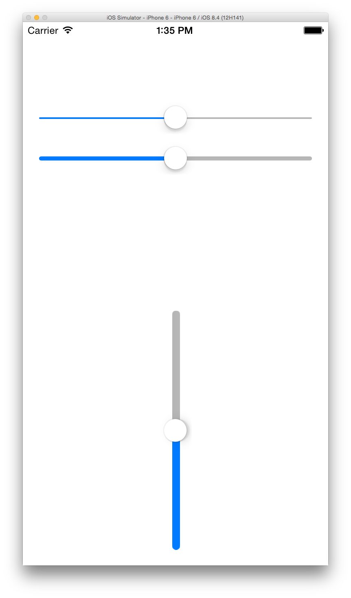

# UISlider-TrackHeight
调整UISlider的滑动条高度 
<p align="center" >

</p>

## Import
[CocoaPods](http://cocoapods.org)

`pod 'UISlider-TrackHeight', '~> 1.0.2'`

## Usage
```objective-c

#import "UISlider+VDTrackHeight.h"

self.slider.vd_trackHeight = 5.0f;

```
## License

[MIT license](LICENSE)
